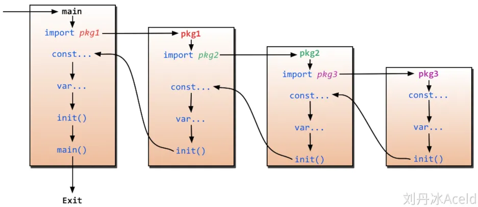

## 课程序言

### 优势

- 极简单的部署方式
  - 可直接编译成机器码
  - 不依赖其他库
  - 直接运行即可部署
- 静态类型语言
  - 编译的时候可以检查出来大多数问题
- 语言层面的并发
  - 天生的基因支持
  - 充分的利用多核
- 强大的标准库
  - runtime系统调度机制
  - 高效的GC垃圾回收
  - 丰富的库
- 简单易学
  - 25个关键字
  - C语言简介基因，内置C语法支持
  - 面向对象特征（继承、多态、封装）
  - 跨平台
- “大厂”领军
  - Google
  - Meta
  - Tencent
  - Baidu
  - 。。。

#### 适合用来做什么

1. 云计算项目
2. 基础后端项目
3. 微服务
4. 互联网基础设施

#### 成就

- docker
- kubernetes

### 不足

1. 包管理不够优秀，大部分包都在Github上
2. 所有Exception都用Error来处理
3. 并不是无缝降级到C

## 第一章 初始go语言

### 1. 变量声明

#### 方法一：

指定变量类型，声明后若不赋值，默认值为0

`var a int = 10`

#### 方法二：

根据所附的值自行判断数据类型

`var a = 10`

#### 方法三：

`v_name := value`

使用这种方法所声明的变量不应该被声明过

#### 多变量声明：

```go
package main


import "fmt"


var x, y int
var ( //这种分解的写法,一般用于声明全局变量
        a int
        b bool
)


var c, d int = 1, 2
var e, f = 123, "Hello world!"


//这种不带声明格式的只能在函数体内声明
//g, h := 123, "需要在func函数体内实现"


func main() {
        g, h := 123, "需要在func函数体内实现"
        fmt.Println(x, y, a, b, c, d, e, f, g, h)


        //不能对g变量再次做初始化声明
        //g := 400


        _, value := 7, 5  //实际上7的赋值被废弃，变量 _  不具备读特性
        //fmt.Println(_) //_变量的是读不出来的
        fmt.Println(value) //5
}
```

### 2. 声明常量

常量中的数据类型只可以是布尔型、数字型和字符串型

使用`const`来定义常量

```go
package main

import "fmt"

func main() {
   const LENGTH int = 10
   const WIDTH int = 5   
   var area int
   const a, b, c = 1, false, "str" //多重赋值


   area = LENGTH * WIDTH
   fmt.Printf("面积为 : %d\n", area)
   println(a, b, c)   
}
```

#### 常量与枚举

常量可以用于枚举

```go
package main

import "fmt"

const (
  Unknown = 0
  Female  = 1
  Male    = 2
)

func main() {
  fmt.Print(Unknown, Female, Male)
}

```

#### iota

在定义常量中使用`iota`关键字，简化了常量用于增长数字的定义

### 3. 函数

Go 中的函数可以返回多个值

使用`func 函数名(传参1, 传参2)(返回值1, 返回值2)`的方式函数的返回值

#### go函数运行路径



先进入包，再从`init()`函数中返回

#### import导包的应用

1. 匿名包：当你需要使用一个包的init函数，但不需要其他函数时，使用匿名导入包的写法 - 加`_`
2. 给包起别名：包名很长时，在包路径加自定义包名，可以给包起别名 - `mylib "./mainlib/mylibone"`
3. 直接调用包函数：使用`.`可以直接调用包里面的函数，而不需要写包名

### 4. 指针

Go 中的指针写法大致和c相同

`var a *int = &b`

### 5. defer调用顺序

defer函数与析构函数类似，在一个结构关闭的最后激活

当有多个defer函数时，采用栈结构先进后出的顺序

### 6. 数组与动态数组的区别

